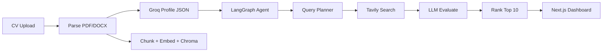

# JobScout AI

JobScout AI is an autonomous career agent for the SMIT Agentic AI Hackathon. It ingests a candidate CV (PDF or Word), extracts a structured profile with local RAG-style chunking and embeddings, plans diverse job search queries with an LLM, searches real-time listings via Tavily, scores each role against the profile with Groq, and returns ranked matches with short natural-language reasoning.

## Architecture

- **Frontend (`frontend/`)**: Next.js 14 (App Router), TypeScript, and Tailwind CSS. The dashboard uploads CVs, shows agent status, and lists scored job cards with filters (UI wiring to the API is prepared in components).
- **Backend (`backend/`)**: FastAPI + Uvicorn. Routers expose `/api/cv/upload` for parsing, profile extraction, and Chroma in-memory storage, and `/api/jobs/search` for the LangGraph agent loop (plan → search → evaluate → rank).
- **RAG path**: PyMuPDF / python-docx for text, Groq Llama 3 for structured JSON profile extraction, `sentence-transformers` (`all-MiniLM-L6-v2`) for embeddings, and ChromaDB ephemeral collections keyed by `session_id`.
- **Agent path**: LangGraph `StateGraph` nodes call Groq for query planning and per-job evaluation, and Tavily for live search results.



## Setup

### Prerequisites

- Python 3.11+
- Node.js 18+ (LTS recommended)

### Backend

```bash
cd backend
python -m venv .venv
.venv\Scripts\activate
pip install -r requirements.txt
copy .env.example .env
```

Edit `.env` and set `GROQ_API_KEY` and `TAVILY_API_KEY` (never commit real keys).

```bash
uvicorn main:app --reload --host 0.0.0.0 --port 8000
```

### Frontend

```bash
cd frontend
npm install
copy ..\\.env.example .env.local
```

Set `NEXT_PUBLIC_API_URL` to your API base (for example `http://localhost:8000`). Then:

```bash
npm run dev
```

Open `http://localhost:3000`.

## Environment variables

| Variable | Where | Description |
| --- | --- | --- |
| `GROQ_API_KEY` | Backend `.env` | Groq API key for Llama 3 profile extraction, query planning, and job evaluation. |
| `TAVILY_API_KEY` | Backend `.env` | Tavily API key for real-time web/job search. |
| `NEXT_PUBLIC_API_URL` | Frontend `.env.local` | Base URL of the FastAPI server (no trailing slash required). |

## Deployment (Vercel + hosted API)

The app is split: **Next.js on Vercel** and **FastAPI on a host** (Render below; Railway/Fly.io/VPS work the same idea).

### 1. Backend (Render — recommended)

1. Push this repo to GitHub (already done if you use the remote above).
2. In [Render](https://dashboard.render.com): **New → Blueprint** → select your GitHub repository.
3. Render reads `render.yaml` at the repo root: web service `jobscout-ai-api`, `rootDir: backend`.
4. When prompted, set **Environment** (or later under **Environment**):
   - `GROQ_API_KEY`
   - `TAVILY_API_KEY`
5. Wait for deploy. Copy the public URL, e.g. `https://jobscout-ai-api.onrender.com` (no trailing slash).

**Start command** (already in blueprint): `uvicorn main:app --host 0.0.0.0 --port $PORT`

**Manual Web Service** (if you skip Blueprint): New → Web Service → same repo → **Root Directory** `backend` → Build `pip install -r requirements.txt` → Start `uvicorn main:app --host 0.0.0.0 --port $PORT` → add the two env vars.

**Free tier note:** First request after idle can take ~50s (cold start). `sentence-transformers` + PyTorch increase RAM; if the build or runtime fails on the smallest instance, upgrade the Render plan or switch to a host with more memory.

**Other hosts:** [Railway](https://railway.app), [Fly.io](https://fly.io), or a **Hostinger VPS** (install Python 3.11, clone repo, `cd backend`, venv, `pip install -r requirements.txt`, run `uvicorn` behind nginx or use a process manager). CORS is already `*` on the API.

### 2. Frontend (Vercel)

1. Go to [Vercel](https://vercel.com) → **Add New… → Project** → import the same GitHub repo.
2. **Root Directory:** set to `frontend` (important for this monorepo).
3. Framework: Next.js (auto). Build: `npm run build`, Output: default.
4. **Environment Variables** (Production — and Preview if you use previews):

   | Name | Value |
   | --- | --- |
   | `NEXT_PUBLIC_API_URL` | Your API origin only, e.g. `https://jobscout-ai-api.onrender.com` — **no trailing slash** |

   The browser calls this URL for `/api/cv/upload` and `/api/jobs/search`. Your FastAPI app already allows all origins in CORS.

5. Deploy. Open the Vercel URL and test upload → Find Jobs.

**Alternative (same-origin proxy on Vercel):** Leave `NEXT_PUBLIC_API_URL` empty and set `BACKEND_URL` in Vercel to your Render API URL so [`next.config.js`](frontend/next.config.js) rewrites `/api/*` to the backend. Prefer setting `NEXT_PUBLIC_API_URL` for clarity in production.

### 3. Hugging Face (optional)

A [Hugging Face Space](https://huggingface.co/spaces) can host the API in Docker for demos; point `NEXT_PUBLIC_API_URL` at the Space URL.

Keep repositories free of secrets; use provider dashboards for production keys.

## License

Hackathon / educational use unless otherwise specified.
