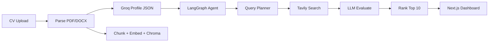

# JobScout AI

JobScout AI is an autonomous career agent for the SMIT Agentic AI Hackathon. It ingests a candidate CV (PDF or Word), extracts a structured profile with local RAG-style chunking and embeddings, plans diverse job search queries with an LLM, searches real-time listings via Tavily, scores each role against the profile with Groq, and returns ranked matches with short natural-language reasoning.

## Architecture

- **Frontend (`frontend/`)**: Next.js 14 (App Router), TypeScript, and Tailwind CSS. The dashboard uploads CVs, shows agent status, and lists scored job cards with filters (UI wiring to the API is prepared in components).
- **Backend (`backend/`)**: FastAPI + Uvicorn. Routers expose `/api/cv/upload` for parsing, profile extraction, and Chroma in-memory storage, and `/api/jobs/search` for the LangGraph agent loop (plan → search → evaluate → rank).
- **RAG path**: PyMuPDF / python-docx for text, Groq Llama 3 for structured JSON profile extraction, `sentence-transformers` (`all-MiniLM-L6-v2`) for embeddings, and ChromaDB ephemeral collections keyed by `session_id`.
- **Agent path**: LangGraph `StateGraph` nodes call Groq for query planning and per-job evaluation, and Tavily for live search results.



## Setup

### Prerequisites

- Python 3.11+
- Node.js 18+ (LTS recommended)

### Backend

```bash
cd backend
python -m venv .venv
.venv\Scripts\activate
pip install -r requirements.txt
copy .env.example .env
```

Edit `.env` and set `GROQ_API_KEY` and `TAVILY_API_KEY` (never commit real keys).

```bash
uvicorn main:app --reload --host 0.0.0.0 --port 8000
```

### Frontend

```bash
cd frontend
npm install
copy ..\\.env.example .env.local
```

Set `NEXT_PUBLIC_API_URL` to your API base (for example `http://localhost:8000`). Then:

```bash
npm run dev
```

Open `http://localhost:3000`.

## Environment variables

| Variable | Where | Description |
| --- | --- | --- |
| `GROQ_API_KEY` | Backend `.env` | Groq API key for Llama 3 profile extraction, query planning, and job evaluation. |
| `TAVILY_API_KEY` | Backend `.env` | Tavily API key for real-time web/job search. |
| `NEXT_PUBLIC_API_URL` | Frontend `.env.local` | Base URL of the FastAPI server (no trailing slash required). |

## Deployment

- **Backend**: Deploy the `backend` folder to [Render](https://render.com), [Railway](https://railway.app), or similar. Set `GROQ_API_KEY` and `TAVILY_API_KEY` in the host’s secret manager. Start command: `uvicorn main:app --host 0.0.0.0 --port $PORT` (adjust `$PORT` to your platform’s convention).
- **Frontend**: Deploy to [Vercel](https://vercel.com) from the `frontend` directory. Set `NEXT_PUBLIC_API_URL` to the public API URL of your deployed backend.
- **Alternative**: A [Hugging Face Space](https://huggingface.co/spaces) can wrap either a Dockerized full stack or the API alone for judging; ensure CORS allows your frontend origin when split across domains.

Keep repositories free of secrets; use `.env` locally and provider dashboards for production keys.

## License

Hackathon / educational use unless otherwise specified.
